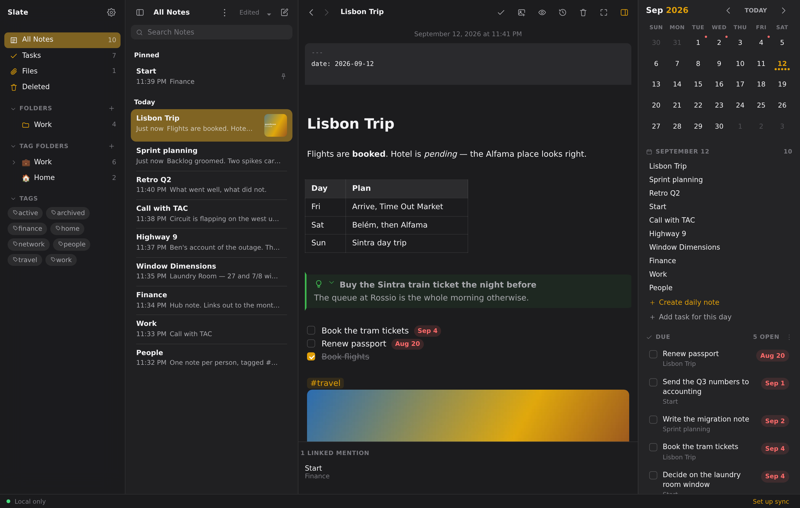

# Slate

A local-first markdown notes PWA. Apple Notes' layout, Obsidian's linking, plain
`.md` files in a folder you own, and sync that is built to never lose a note.

Runs installed on Windows, macOS, Linux, Android and iOS from one codebase. No
server to run — the app is static files; your notes live on your WebDAV server or
in your Google Drive.



---

## Quick start

```bash
npm install
npm run dev            # http://localhost:5173
npm run build          # typecheck + production build into dist/
npm run preview        # serve the production build
npm test               # 447 unit and two-device sync tests
node scripts/smoke.mjs # 383-check browser smoke test against dist/
```

The app works immediately with no configuration — it just stays on one device
until you set up a backend in Settings (⌘,).

---

## What it does

**Writing.** Three ways to look at the same file, switched in Settings or with
⌘⇧M, and the buffer is always the exact text of the `.md` file in all of them,
so nothing is ever silently rewritten:

- **Rich text** — a word processor. No `#`, no `**`, ever: a formatting bar
  (Title / Heading / Subheading / Body, **B** *I* <u>U</u> ~~S~~, highlight,
  monospace, lists, checklists, indent, quote) applies the markdown for you and
  lights up to show what the caret is sitting in. On a phone the same controls
  open as a Format sheet from the **Aa** button. Markdown still works while you
  type — `# ` at the start of a line is still a Title, and the marker vanishes
  the moment it becomes one. Applying a marker leaves the caret after it, so a
  new checklist item is ready to be typed into rather than in front of its own
  checkbox.

  **Every key is measured against what you can see**, rather than against the
  characters behind it. Enter at the start of a heading takes the heading down
  with its words and leaves blank space above; in front of a checkbox it opens
  an empty checkbox above; at the end of a highlighted phrase the break lands
  after the highlight instead of through it. Backspace at the start of a line
  takes that blank space back before it takes anything else, so it undoes the
  Enter that made it — and only then does the line's own style come off, all of
  it at once. Delete at the end of a line is the same rule facing the other way.
  And what you copy carries what you cannot see with it: a highlighted word
  arrives somewhere else still highlighted, a heading still a heading, and
  cutting one leaves an empty line rather than a stray `## `.

  The bar also inserts the two things markdown makes tedious by hand: a
  **link**, through a dialog with the words and the address as separate fields,
  and a **table**, which then offers add/remove row and column from the same
  button, along with *Copy table* for getting one into a spreadsheet. A table cell
  is typed into directly, and on a phone it stays outlined while the Format
  sheet is up — the sheet only opens once the keyboard is down, so the cell has
  necessarily lost its focus, and "add a row below" has to be beside a row you
  can still see.

  **The bar never runs off the edge of the pane.** The editor is the panel that
  never yields width, so with the calendar inline and both left panels open
  there can be less than half the bar's natural width to put it in. What does
  not fit collapses into a **…** at the right-hand end, which opens the rest as
  a menu — with each control's full name, whether it is currently on, and
  greyed out when it does not apply, the same as the button would be. Groups go
  whole rather than button by button, so the bar never strands one orphaned
  control from a group whose siblings are all in the menu, and they come back as
  soon as there is room. It is a bar-only affordance: the phone's Format sheet
  is as wide as the screen and lays the same controls out over three rows.
- **Live preview** — formatting renders as you type, and the raw syntax
  reappears the moment your caret enters it.
- **Markdown source** — the file, exactly as it is written.

Underline has no markdown syntax, so it is written as `<u>…</u>`, which every
renderer passes through; highlight uses `==text==`. Everything else is ordinary
CommonMark, and a note written in rich text opens as plain markdown anywhere
else.

**A note opens as a page to read.** No caret anywhere in it, which on a phone is
the difference between opening a note and opening a note with a keyboard across
the bottom half of it before you have read a word. Tap the text and that is
where the caret lands — the tap that starts the edit is the tap that says where
— or press the pencil in the header, which starts you at the top of whatever is
on screen rather than scrolling the note out from under you. Escape hands the
note back. Links, checkboxes, images and a task's date chip all still answer
a tap while reading, so you can work through a note without falling into the
editor, and a checkbox ticked or a date set in passing still saves: reading is
not read-only. A brand new note is the
one exception — there is nothing in it to read, so it opens with the caret
already in it, and so do the notes the app seeds for you, like a new daily note.
While a note is being read the formatting bar, the phone's **Aa** button and
Insert are not on screen; all three act on a caret, and there is not one yet.

Above every note, in all three modes, sits the date it was last edited — faint,
centred and out of the way, the way Apple Notes does it. Hover it for when the
note was created.

The body itself runs flush with the left edge of its pane and takes the full
width, so on a big monitor a wider window is wider text rather than wider
margins. Settings → Editor → **Body width** switches it to a centred 760px
reading column instead; the backlinks underneath follow whichever you pick.

**Links that leave the vault.** A `https://`, a `mailto:`, a `tel:`, an
`ssh://` to the box you keep notes about — written as markdown or left bare —
renders as a link and opens in whatever program handles it. With a pointer a
click opens and a right-click offers *Open · Copy · Edit*; on a phone, where
there is no right-click and the address is hidden behind the label, a tap
offers the same three. That tap is handled as a tap rather than as the mouse
events a phone invents from one afterwards — they arrive too late to keep the
caret out of the text, and the click trailing them would land on the menu the
tap just opened. Installed on an iOS Home Screen, a web link is handed to the
system rather than opened in a window of its own: there is no tab to put one in,
so `window.open` there opens an empty view inside the app and leaves it behind
for you to dismiss. `javascript:` and `data:` are never opened: a note that syncs
from a shared vault is untrusted input.

**Linking.** `[[Note Title]]` links notes to each other. Typing `[[` opens an
autocomplete over every note; picking one that doesn't exist yet offers to create
it. Clicking a broken link creates the note on the spot. Renaming a note rewrites
every link that pointed at it. Each note lists its own backlinks underneath.

**Images and files.** Paste, drop, or use the toolbar's insert button — **Take
Photo**, **Photo Library**, or **Choose File**. On a phone, Take Photo opens the
camera directly. Every route lands in the same place: images are re-encoded on
the way in — a 1.4 MB screenshot becomes 11 KB of WebP, a 122× reduction, with
no visible difference at reading size — and every image is resizable by dragging
its right edge (the width is written back into the markdown as
`![[img.png|400]]`) and opens in the lightbox on click. PDFs, video, audio and
text files can live in the vault too.

In the lightbox a picture is handled rather than operated: pinch to zoom around
whatever is between your fingers, drag to move around it — it stops with its
edge at the edge of the screen rather than sliding off into the dark — and tap
to go from fitted to 2× and back. A pointer gets the same gestures (drag to pan,
click to zoom) plus the `−` / `1:1` / `+` buttons and the `-`, `0`, `+` keys;
those buttons are hidden on a phone, where fingers do the job better and the
space is worth more to the file name.

In rich text an image stays an image: putting the caret beside one never swaps
it back for `![[img.png]]`, and it takes no margin of its own, so a line of
text sits immediately above or below it unless you write a blank line.

A capture that arrives as a bare `image.jpg` gets a dated name so a folder of
them stays browsable; a library filename you'd recognise — `IMG_0421`,
`Screenshot 2026-08-31` — is kept as-is.

**Renaming a file repoints every note that used it**, in the shape each
reference was written in: a bare `![[logo.png]]` stays bare, a path relative to
the note stays relative, a full vault path stays full. Right-click a file (or
swipe it on a phone) to rename or delete it; deleted files go to Recently
Deleted like anything else.

**Files that nothing points at are flagged.** The Files browser marks every
attachment no note references — embedded or plainly linked, by path, relative
path or bare filename — as **Orphaned**, and the count in the header filters the
list down to them. A file in the vault that no note uses is invisible dead
weight that still syncs to every device; this is how you find it before there
are two hundred of them.

**Tables render as tables**, including the formatting inside their cells: bold,
italics, `code`, strikethrough, links, wikilinks, tags and images all render in a
cell.

In rich text you type straight into the cells — the table never shows its pipes.
Tab moves along a row and Enter down a column, both adding a row when they run
off the end; Escape puts you back in the note. A pipe typed into a cell is
escaped rather than becoming a new column, and the file goes on holding an
ordinary GFM table, printed with its columns lined up so it still reads as text.
Live preview keeps its own contract: clicking a table there puts the caret in
the pipe source, the same way the caret reveals every other construct it sits
in.

**A spreadsheet range pastes as a table.** Copy cells in Excel, Numbers, Sheets
or Calc and paste: you get a GFM table with the columns lined up, not a wall of
tabs. Excel puts *three* things on the clipboard — a `<table>` under
`text/html`, the same cells tab-separated under `text/plain`, and a **picture**
of the range as an ordinary PNG. The picture is the trap: an image-first paste
handler files that instead, and a spreadsheet paste becomes a screenshot of a
spreadsheet. So the table is looked for first, and nothing is lost by it —
finding a table needs a `<table>` in the html *and* text that parses as a grid
at least two columns wide, which a copied image matches neither of.

The two text flavours are both used, for different jobs. The HTML is only ever a *discriminator*: its presence is what
says this came out of a grid rather than out of a terminal, which nothing in the
plain text can tell you, so tab-separated text pasted from anywhere else stays
text. The cells themselves are read from the plain-text flavour, because Excel's
HTML is a wall of `mso-` styles and parsing it would mean trusting markup from
outside the app.

The two things a spreadsheet holds that a pipe table cannot are handled on the
way in rather than dropped: a cell containing a `|` is escaped so it can't end
its column, and a multi-line cell is flattened onto its row.

**And back out again.** Select rows of a table, copy, and they land in Excel as
cells. Only the HTML flavour is added, which is the whole trick: every
spreadsheet reads HTML in preference to plain text — it is how a table copied
from a web page lands in cells, and it is the same flavour Excel *emits*, which
is what the paste above keys off. So the plain-text flavour is left as the
markdown you selected, and the same copy pastes into another markdown editor as
the pipe table it was. Writing tab-separated text over the top would have
bought the first and lost the second.

There are two ways to ask. **Put the caret in the table and choose *Copy table*
from the table button** — the same ⊞ that adds and removes rows — which is the
reliable one, and the only practical one on a phone. Or **select the rows and
copy**, which works in all three modes but is a gesture with no edges: in rich
text and live preview the table is a single widget, and a drag that overshoots
it by a few pixels has taken in the paragraph underneath.

That is because the selection route is deliberately strict about what counts.
Selecting a word inside a cell is a request for that word, so a selection has to
cover a whole line or run across more than one; and every line it touches has to
belong to the same table, or a selection running from the last row into the
paragraph below would quietly drop the paragraph. Anything that doesn't qualify
copies exactly as it did before — which is safe, but silent, which is why the
menu item exists. Either way the `| --- |` row is left behind: it is markdown
bookkeeping, not data.

**Block quotes can say what kind of aside they are.**

```markdown
> [!WARNING] Friday deploys
> The window closes at 16:00.
```

renders as a titled, coloured callout with an icon. The syntax is **GitHub's**,
which is the reason to like it: GitHub renders these, every other markdown tool
falls back to an ordinary blockquote, and the file on disk stays plain
CommonMark — a note with callouts in it loses the tint somewhere else and
nothing more.

Five colours, because five is what GitHub defines — `note`, `tip`, `important`,
`warning`, `caution` — and every extra one is a hue that has to stay legible in
both themes forever. The longer vocabulary people actually type is aliased onto
those five and keeps its own glyph where the glyph says something the colour
does not: `[!bug]` is a bug in caution red, `[!question]` a question mark in
important purple, `[!success]` a tick in tip green. A name nobody defined is not
a broken callout — it stays the blockquote it is, exactly as GitHub treats an
unknown alert.

Type `> [!` and the list of types appears, with the colour family each alias
lands in beside it; there is no toolbar button, because the formatting bar
exists only in rich text while the syntax works in all three modes. Omit the
title and the callout announces its own type instead. Put the caret on that
line and the raw `[!warning]` comes back to be edited, the same way a link's URL
does.

**Code blocks have a copy button** in the top right corner — on hover with a
pointer, always visible on a touch screen, and it works while a note is being
read, which is where it is wanted most. It copies the code without its fences,
and without the indentation of a block nested in a list.

The fence itself comes back the moment the caret is in the block, in rich text
as well as live preview. The language written on it — ` ```js ` — is what turns
the syntax highlighting on, and it lives in that one place with no picker
anywhere else, so a permanently hidden fence would be a block you could not
label and could not find the ends of. Everything else about a code block stays
hidden in rich text; this is a fence, a link's URL and a callout's `[!type]`
being the same kind of thing.

**A note names itself, if you let it.** A note made with *New note here* — and
every note started from a template — is called `Untitled`, so typing a heading
into one leaves the file, the note list and any `[[wikilink]]` to it all saying
Untitled about a note that plainly is not. Pause after typing that heading and
a toast offers the name; taking it renames the file, and ignoring it costs
nothing. The offer is only ever made for a note that has **never been named** —
plenty of vaults keep `2026-09-04.md` headed `# Thursday` on purpose, and an
app that asked about that every time you paused would be a nuisance rather
than a help. Nothing renames a file in a synced vault without being asked.

**A note can leave.** Right-click one (or long-press it) for **Share…** on a
phone and **Export as Markdown** everywhere else; ⌘K has it too, for the note
you have open. Nothing is converted — the bytes that leave are the bytes on
disk, frontmatter and wikilinks included — because the file was already the
portable thing. Where the platform has a share sheet you get it, which is the
one route from here into Mail; where it hasn't, the file downloads.

**Pinned notes** sit in their own section at the top of the list — sorted the
same way everything else is, by date edited, date created or title — and stay
there while the rest of the list re-sorts around them. Pin from the note's
context menu, or by putting `pinned: true` in its frontmatter.

**Folders and Tag Folders.** Ordinary folders nest as deep as you like and are
real directories in the vault. Tag Folders are saved boolean rules that gather
notes automatically — `#work AND (#urgent OR #blocked) NOT #archived` — and own
nothing, so deleting one never touches a note. Rules also understand
`folder:Work` and `has:tasks`, tags match hierarchically (`#work` catches
`#work/active`), and two terms side by side mean AND.

**A Tag Folder can gather tasks instead of notes.** Same folder, same rule
language, one switch — *Gathers: Notes / Tasks* — because a second tree beside
the first would have meant learning "a saved rule" twice.

The reason it is worth having is **inheritance**: a task carries the tags on its
own line *and* the ones its note carries. Tag a note `#home`, write ten jobs on
it, and `#home` gathers all ten without any of them being tagged by hand — which
is how people actually keep notes, and the alternative is the same information
typed eleven times. A tag written on one task line is that task's own; it does
not leak to its siblings, though it does still count towards the note (the note
really does contain urgent work).

Rules over tasks reach two things a note cannot answer: `is:open` / `is:done`,
and `due:overdue`, `due:today`, `due:soon`, `due:none`, `due:any`. So

```
#home is:open              the jobs at home still to do
#work due:overdue          work that has slipped
#home AND NOT #urgent      everything at home that can wait
```

**Finished tasks are out of the list by default**, with *Show completed* in the
same ⋮ menu to bring them back. A list whose top is what you owe and whose
bottom is a growing archive of what you don't is a list people stop reading —
and `is:done` already answers the archive question for anyone who wants it. The
heading still counts them (*4 open · 12 done*), so nothing is hidden without
saying so, and a group that runs past 200 rows says how many it left out rather
than dropping them quietly.

**Any task list can be arranged**, from the ⋮ beside its heading: *No
grouping*, *By due date* — Overdue, Today, This week, Later, No date, Done, in
that order — or *By note*. One setting for all three places a task list
appears, because it is a way of reading such a list rather than a property of
one of them, and grouping by note stops repeating the note's name down the side
of every row.

Not **by tag**, and that is a decision rather than an omission. A task carries
the tags on its own line *and* the ones its note carries, so a job that is both
`#home` and `#urgent` has no single group: it belongs in two, which means the
same task in the list twice, a tick that has to update both, and counts that no
longer sum. The inheritance that makes task tags worth having is exactly what
makes grouping by them ambiguous. Due date and note are one apiece.

The tasks appear in the note list's place, as the same rows the calendar rail
and the phone's Tasks tab use — so ticking one there writes to the note it lives
on, and it leaves the folder if the folder asked for open ones. The count beside
the folder counts tasks, not the notes they sit on, and a small tick on the row
says which kind of folder you are about to open: it sits in the same list as
folders that gather notes, with the same emoji and the same count beside it. A
tick is on offer as the icon as well, but the one on the row is drawn from what
the folder *does* — an icon anyone can put on anything cannot be trusted to say
so. Written into a rule over
*notes*, `is:` and `due:` match nothing and the folder's live count says so as
you type.

**Tag Folders nest too, and nesting means something.** By default a child
*narrows* its parent, so the hierarchy reads the way a folder tree does — a
child is always a subset. A parent of `#work` with a child `#active` and a
grandchild `#urgent` gives you `#work`, then `#work AND #active`, then
`#work AND #active AND #urgent`, and editing the parent re-narrows the whole
subtree at once.

```
💼 Work            #work                                   6
  ⚡️ Active        #work and #active                       1
    🔥 Urgent      #work and #active and #urgent           0
  🧾 Archived      #work and #archived                     1
🏠 Home            #home                                   2
```

Untick **Narrow** on any child and the nesting becomes purely visual — its rule
stands alone, useful for grouping unrelated rules under one heading. Leave a
folder's rule *empty* and it becomes a grouping folder: it shows the union of
everything nested beneath it. Deleting a parent promotes its children rather
than taking them with it; "delete with everything inside" is a separate item.

Both kinds of folder are defined in `backstage/`, so they follow you to every
device.

**Folder templates, if you want them.** A folder can start its new notes from
boilerplate — a meeting note with the fields you always fill in, a person note
with the same four headings, a daily note that already knows its date.

A template is **an ordinary note in an ordinary folder**. `Templates/` is a real
directory holding real `.md` files, so a template is written, edited, searched,
linked and synced exactly like everything else: there is no template format, no
template editor, and nothing to export. Open one, change it, and the next note
made from it picks the change up.

**And nothing about it happens until you ask.** `Templates/` is never created
for you — not at boot, not by the first note, not by looking at the feature.
A vault without one behaves in every respect as though none of this existed: no
folder in the sidebar, no item in any menu, nothing to turn off. Settings →
Editor offers to make it, and that button is the only thing in the app that
does; it writes one example template so there is something to look at rather
than an empty folder. Once templates exist, a folder's context menu gains
**Use a template…**, and names the one it is using afterwards — or says
*missing* if that note has since been renamed or deleted, rather than looking
configured while quietly applying nothing.

```
Templates/
├─ Meeting.md          ← ordinary notes, edited like any other
└─ Person.md
```

The fields a template can fill in are deliberately few: `{{title}}`, `{{date}}`,
`{{time}}`, `{{year}}`, `{{month}}`, `{{day}}`, `{{weekday}}`, and `{{cursor}}`
for where writing should start. `{{date}}` and `{{time}}` take a pattern —
`{{date:DDDD, D MMMM YYYY}}` — built from `YYYY MM DD HH mm ss`, with `MMM` /
`MMMM` for the month by name and `DDD` / `DDDD` for the day. A field nobody
recognises is left exactly as written, so a typo looks like a typo in the note
rather than disappearing into it. The line between "a few fields filled in" and
"a template language with conditionals in it" is one that gets crossed a token
at a time, and this is the side of it the app stays on.

`{{title}}` is the note's name **at the moment it is created**, and it is empty
when the note has not got one yet — "Untitled" is the absence of a title rather
than a title, and a template that wrote that word into a heading would be worse
than one that left the heading blank. So `# {{title}}{{cursor}}`, which is what
the example template is, is right in every case: a daily note or one made from
a `[[wikilink]]` is named already and gets its heading filled in, and one made
with *New note here* gets an empty heading with the caret sitting in it.

A template applies to **the folder it is attached to and no other**: one on
`Work` does not reach `Work/Projects`. Inheritance would be a second rule to
hold in your head, and a template on the vault root would then silently apply to
every note anywhere — which is how an optional feature stops feeling optional.

The vault root can have one too, set in Settings rather than from a menu,
because it is the one folder with no row in the sidebar to right-click. It
covers ⌘N with no folder selected, and **a note created from a broken
`[[link]]`** — which always lands there, and is named for the link text. That
is the case `{{title}}` is really for.

**Templates stay out of the roll-ups.** They are real notes, so without care
every view that adds your notes up would count them — and a template is
boilerplate for a note that does not exist yet. Its `- [ ]` is a blank to fill
in rather than a task you owe anybody; its `#work` describes the notes it will
make rather than itself. One meeting template was enough to put a permanent
empty task in the task list, invent a `#meeting` tag, count `#work` twice,
place a dot on the calendar, report a broken link only it mentioned, and land
in the Tag Folder that gathers everything tagged `#work`.

So the roll-ups — the note list, its count, tasks, tag counts, the calendar,
Tag Folder matches, backlinks and broken links — read your notes without the
templates. Everything that looks at one named thing still sees them: browsing
`Templates/` (which is the only way a template gets edited, so hiding the
folder the way `backstage/` is hidden was never an option), search, wikilink
targets, version history and sync. Two of those are not preferences but
correctness — **the orphan scan** has to see templates or a picture used only
by one is reported unused and invited to be deleted, and **rename repointing**
has to, or a template's links break when a note it mentions is renamed.

A vault with no `Templates/` folder gets the identical list back rather than a
filtered copy of it, so none of this costs anything to anyone who never made
one.

The **daily note** is the case this was built for. Point `Daily/` at a template
and every day's note starts from it, dated for *the day it is filed under* rather
than for today — so Thursday's note, started on Saturday, still says Thursday.

**Calendar and tasks.** An optional right column (⌘⇧R) shows a month calendar
with a dot per note, filed by frontmatter `date:`, a `YYYY-MM-DD` filename, or
creation time. Click a day to filter the list. Any day without a daily note
offers to make one — **Create daily note**, at the top of that day's list and
under the day in the rail — which writes `Daily/YYYY-MM-DD.md` and opens it, so
Thursday's note can be started on Saturday and still lands on Thursday. Below
it, **Due**: the tasks that are due today and the ones already late. Ticking a
box there edits the source note.

**A calendar you can write in.** Settings → Editor → **Clicking a day in the
calendar** switches the click from *shows what is filed on that day* to *opens
that day's daily note*, for anyone whose calendar is a journal rather than an
index. The setting exists for one guess about intent: somebody clicking a day
with nothing on it is usually starting to write about it, not looking for what
isn't there. So on an empty day the click asks — one dialog naming the file it
would write, `Daily/YYYY-MM-DD.md` — rather than creating it, because a note
written on a guess is a note somebody has to go and delete. The day is selected
and its notes are listed either way, in both modes, so the setting changes what
a click *adds* and never what it takes away; the difference is that only the
filtering mode lets a second click on the same day take the filter back off,
since where a click means "open this day's note" a second one means it again.

The rail's list is narrowed on purpose. Every `- [ ]` in the vault is rolled up
under **Tasks** in the sidebar, and repeating that list under a calendar made
the two columns compete for the same job. Dates are what the column beside it
is about, so a list scoped to them is the one thing the rail can say that the
sidebar cannot — and an undated job is a job for another day.

**The calendar reads both ways.** A day that owes you work carries a small pip
in its corner — red once the day has passed, the same red the date chip turns
when it is late. It is a channel of its own: the dots under the number mean
notes filed on that day, and making a dot mean two things would cost you both.
Click the day and its tasks appear under its notes, with no heading over them —
a row with a checkbox and a date on it is not going to be mistaken for a note,
and a rule across the panel made two lists out of one day.

Nothing is said twice in one column: the **Due** list below already holds
everything overdue and everything due today, so a day it has covered keeps its
notes and hands the tasks to it. The phone's calendar tab has no such list under
it, so there every selected day keeps its own.

**Due dates you don't have to type.** A task line has two controls, one at each
end: the checkbox that says whether it's done, and a chip that says when it's
for. The chip shows the date in words where there are words for it — *Today*,
*Tomorrow*, *Fri* — and turns red once it's past. Tapping one opens a picker
with four one-tap presets (today, tomorrow, this weekend, next week) over a
month grid; on a phone the same picker arrives as a bottom sheet with
thumb-sized day cells, rather than a popover pinned to a fingertip.

The chip is in both places a task appears. In the task list every row has one,
filled or a faint outline waiting to be given a date. In a note it replaces the
`📅 2026-09-04` in the source, so the line reads as a sentence with a date on
the end instead of a sentence with syntax in it — and a task with no date shows
the outline on the line the caret is in, so a twenty-item checklist doesn't
sprout twenty buttons. ⌘⌥D does the same from the keyboard.

Dates are still just markdown. Reading stays permissive — `📅 2026-09-04`,
`@due(...)`, `due:...` and Dataview's `[due:: ...]` all parse, so a vault
written by another tool works unchanged — and the picker only ever *writes* the
`📅` form.

**One layout that doesn't jump.** Three modes — phone, mid-size, wide — chosen
explicitly rather than by CSS reacting to width on its own. The editor holds a
guaranteed minimum width in all of them, so when space runs short a side panel
is dropped rather than the writing surface squeezed. Crossing a breakpoint never
opens or closes anything by itself.

**Back and forward.** Two arrows to the left of the note's title, over the notes
this window has opened — a vault is a web of links, and three notes into
following one you want the one you started from, which a list sorted by date
cannot give you. Each arrow's tooltip names the note it would take you to, so
"back" is answerable without pressing it first, and a note that has since been
renamed or deleted is stepped over rather than offered. Desktop only: a phone's
editor header already has a back arrow in that spot and it means something
else — it returns to the note list, which is the right thing for it to do.

**Focus mode, and a note in a window of its own.** On a desktop the editor's
header carries one more button. Press it (or ⌘⇧F) and the note takes the whole
window — no sidebar, no list, no calendar, no status bar. The text is laid out
the way Settings → Editor → **Body width** says, the same as it is everywhere
else: full width, or a centred reading column if that is what you have chosen.
Escape gives the app back, after the Escape that puts the caret down.

Hold **Shift** over that same button and it becomes a popout, exactly the way
Gmail's compose window does it: click it and the note steps out into a small
window of its own, to sit beside whatever you are writing about. The pane it
came from shows a card saying where it went, with *Show me* and *Bring it
back* — one window owns a note at a time, so there is never a second caret in
the same file. Closing the popped-out window hands the note straight back, with
everything written in it. Both windows are the same vault: what you type in one
appears in the other's list, search and calendar as you type it, and the window
you started from is the one that syncs. Nothing about either feature exists on a
phone, where the editor is already the whole screen.

**Offline.** The whole app is precached. It opens, reads and writes with no
network at all, and syncs when connectivity returns.

**Never losing things.** Deletes are soft — notes move to `backstage/trash/` and
show up under Deleted, where opening one shows its contents read-only
so you can decide with the note in front of you rather than from its title.
Nothing in there expires: it stays until you restore it, delete that one for
good from its menu, or empty the whole list from the header. Every save, sync pull and delete writes a local
snapshot, and the history dialog restores any of them — each one labelled with
the device it came from, so a version pulled from the server says *which*
machine wrote it. Conflicting edits are merged when possible and kept as two
files when not.

---

## Layout

| | Shows | Side panels |
|---|---|---|
| **Phone** (< 760px) | One tab at a time, bottom pill bar: Notes · Tasks · Calendar · More | Everything else lives in More |
| **Mid-size** (760–1180px) | Note list + editor | Sidebar and calendar open as dismissable drawers |
| **Wide** (≥ 1180px) | Sidebar + list + editor | Calendar sits inline from 1400px, a drawer below that |

Drag the divider on the right of the sidebar or the note list to resize it, or
double-click the divider to put it back; ⌘\ hides the sidebar entirely and the
button in the note list's header brings it back. The editor never gives up its
space: drag the panels wider than the window can afford and they are the ones
that yield.

**⌘⇧F clears the rest of the screen away** — every panel and the status bar with
them — and gives the whole window to the note, laid out however **Body width**
says. The panels are hidden rather than torn down, so the list comes back with
its scroll position and its search exactly as you left them. Shift held over the same
button pops the note into a window of its own instead; see *What it does*.

The sidebar's three sections — **Folders**, **Tag Folders** and **Tags** — each
fold away from their header, and a folded one carries the count of what is
inside it. Which are folded is a preference like any other, so it survives a
reload and follows the vault to your other devices.

Folders inside those sections keep their own shape. A folder is unfolded
because you unfolded it, so unfolding a section — or a folder — never unfolds
everything beneath it, and folding one and opening it again brings back exactly
the tree you left rather than a fresh default. That shape is about the window in
front of you rather than the vault, so it stays on this device and survives a
reload here.

**Search filters the list in front of you.** In Files it searches files, in
Deleted it searches deleted things, in Tasks it searches tasks — the header and
the placeholder both name which, so a screen of five results never goes on
claiming to be All Notes. Anything showing notes searches notes across the whole
vault, folder or no folder, which is the convention every notes app follows and
means a search is never quietly limited to whatever you happened to have open.
Changing scope clears the query, so the box is always about the list under it.

**A result shows the line the match is on**, cleaned of its markdown and cut
around the word, with every term marked in the title and the snippet alike —
because the one thing a result row has to answer is why it is in the list, and
a note's opening line usually says nothing about it. A word that appears only
in the title keeps its ordinary excerpt: there is nothing in the body to point
at, and the marked title has already said why the note is there.

Long-press or right-click a Tag Folder for *New folder inside…*, *Move…*, and
the two delete variants.

On a phone the editor opens full-screen over whichever tab you came from, so
tapping a note in Tasks and pressing back returns you to Tasks. Android's back
button closes the editor before it leaves the app. Long-press any note, folder
or Tag Folder for an action sheet; right-click does the same on a desktop.
Swipe a note, a file or a deleted note to the left for its actions, the way a
mail app does. A Tag Folder's rule is editable from the phone too — its scope
bar above the list carries an **Edit** next to the **Close**.

## Keyboard

| | |
|---|---|
| ⌘K | Command palette / jump to note |
| ⌘N | New note |
| ⌘S | Sync now |
| ⌘F | Find in note |
| ⌘, | Settings |
| ⌘\ | Toggle sidebar |
| ⌘⇧R | Toggle calendar column |
| ⌘⇧F | Focus mode — the note takes the window |
| ⌘⇧M | Cycle rich text → live preview → source |
| ⌘B / ⌘I / ⌘U | Bold / italic / underline |
| ⌘⇧X / ⌘⇧H / ⌘E | Strikethrough / highlight / monospace |
| ⌘⌥1 / ⌘⌥2 / ⌘⌥3 / ⌘⌥0 | Title / Heading / Subheading / Body |
| ⌘K *(with a selection)* | Wrap in a wikilink |
| ⌘⇧L | Add or edit an external link |
| ⌘⇧7 / ⌘⇧8 / ⌘⇧0 | Checklist / bullets / numbers |
| ⌘⌥D *(on a task line)* | Set a due date |
| ⌘⇧9 | Block quote |
| ⌘] / ⌘[ | Indent / outdent a list item |

---

## Setting up sync

### WebDAV — recommended

Works with Nextcloud, ownCloud, Synology, `rclone serve webdav`, Apache
`mod_dav`, and anything else that speaks the protocol. Nothing leaves your
browser except to your server.

In Settings → Sync, choose WebDAV and fill in the URL, username, password and a
vault folder. Nextcloud's URL looks like
`https://cloud.example.com/remote.php/dav/files/USERNAME`.

**Use an app password, not your account password.** Nextcloud: Settings →
Security → Devices & sessions → Create new app password.

#### The one thing that will go wrong: CORS

A browser will not talk to a WebDAV server that hasn't opted in. If "Connect and
test" fails with a network error while the server is plainly up, this is why.
The server must allow your app's origin, allow the WebDAV methods, allow the
headers the client sends, and **expose `ETag`** — that last one is what makes
conflict-safe writes possible.

<details>
<summary><b>Nextcloud / Apache</b></summary>

```apache
<IfModule mod_headers.c>
  SetEnvIf Origin "^https://notes\.example\.com$" ORIGIN_OK=$0
  Header always set Access-Control-Allow-Origin %{ORIGIN_OK}e env=ORIGIN_OK
  Header always set Access-Control-Allow-Credentials "true"
  Header always set Access-Control-Allow-Methods "GET, HEAD, PUT, DELETE, OPTIONS, PROPFIND, MKCOL, MOVE, COPY"
  Header always set Access-Control-Allow-Headers "Authorization, Content-Type, Depth, If-Match, If-None-Match, Overwrite, Destination"
  Header always set Access-Control-Expose-Headers "ETag, Last-Modified, Content-Length"
  Header always set Access-Control-Max-Age "86400"
  # Preflight must answer 200 without hitting the DAV backend.
  RewriteEngine On
  RewriteCond %{REQUEST_METHOD} OPTIONS
  RewriteRule ^(.*)$ $1 [R=200,L]
</IfModule>
```

Nextcloud also needs your origin whitelisted in `config/config.php`:

```php
'cors.allowed-domains' => ['https://notes.example.com'],
```
</details>

<details>
<summary><b>Caddy</b> (simplest if you're putting a reverse proxy in front)</summary>

```caddy
notes-dav.example.com {
  @cors header Origin https://notes.example.com
  header @cors {
    Access-Control-Allow-Origin "https://notes.example.com"
    Access-Control-Allow-Credentials "true"
    Access-Control-Allow-Methods "GET, HEAD, PUT, DELETE, OPTIONS, PROPFIND, MKCOL, MOVE, COPY"
    Access-Control-Allow-Headers "Authorization, Content-Type, Depth, If-Match, If-None-Match, Overwrite, Destination"
    Access-Control-Expose-Headers "ETag, Last-Modified, Content-Length"
  }
  @preflight method OPTIONS
  respond @preflight 204

  reverse_proxy localhost:8080
}
```
</details>

<details>
<summary><b>rclone</b> (handy for a quick test)</summary>

```bash
rclone serve webdav /path/to/vault \
  --addr :8080 \
  --user mike --pass secret \
  --etag-hash MD5
```

`rclone serve` sends no CORS headers, so put it behind the Caddy block above, or
serve the app from the same origin.
</details>

**The bulletproof shortcut:** serve the app itself from the same origin as the
WebDAV endpoint (e.g. `https://cloud.example.com/notes/`). Same-origin requests
skip CORS entirely and nothing above applies.

### Google Drive

Free, durable, nothing to self-host. It needs a one-time OAuth client, which is
free and takes about ten minutes.

1. <https://console.cloud.google.com> → create a project.
2. **APIs & Services → Library** → enable **Google Drive API**.
3. **OAuth consent screen** → External → add your own email as a test user.
   (Staying in "testing" mode is fine for personal use. Tokens expire weekly in
   that mode, so you'll re-authorize occasionally; publishing the app removes
   that but triggers a verification review.)
4. **Credentials → Create credentials → OAuth client ID → Web application.**
   Under *Authorized JavaScript origins*, add the exact origin you serve the app
   from, e.g. `https://notes.example.com` and `http://localhost:5173`.
5. Paste the client ID into Settings → Sync.

Slate requests only the `drive.file` scope, so it can see nothing in your Drive
except the files it created itself.

**One caveat, stated plainly:** Drive v3 removed ETag preconditions, so a
conditional write isn't available. Slate re-reads each file's revision
immediately before writing and refuses if it moved, which leaves a race window of
a few hundred milliseconds. Drive's own file version history is the backstop.
WebDAV has no such gap — if two devices are often edited within the same second,
prefer it.

### No backend

Perfectly usable. Notes stay in this browser's storage. In Settings → About,
"Request persistent storage" asks the browser not to evict them; installing the
app as a PWA makes that far more likely to be granted.

---

## Deploying

**There is a build step.** The source is TypeScript and JSX, which no browser
can execute. Serving the project folder directly from a static server — macOS
Apache's `~/Sites`, `python -m http.server`, anything — hands the browser
`src/main.tsx`, the server 404s it with an HTML error page, and you get:

> Failed to load module script: Expected a JavaScript-or-Wasm module script but
> the server responded with a MIME type of "text/html".

Run `npm install` once, then either `npm run dev` for development or
`npm run build` and serve `dist/`.

`dist/` uses **relative** asset paths, so it runs from anywhere — a domain root,
`~/Sites/slate/`, a GitHub Pages subpath — with no configuration. To serve it
from macOS's user web directory:

```bash
npm install && npm run build
cp -R dist/ ~/Sites/slate/      # then open http://localhost/~you/slate/
```

Only set `VITE_BASE=/subdir/` if you specifically need absolute paths.

HTTPS is required for service workers and PWA install (localhost is exempt), so
offline mode and installing won't engage over plain `http://` on a LAN address.

To put it on a static host:

```bash
npm run build

# Netlify
netlify deploy --prod --dir=dist

# Cloudflare Pages
wrangler pages deploy dist

# Vercel
vercel deploy --prod dist
```

**Installing it.** Desktop Chrome/Edge: the install icon in the address bar.
Android Chrome: menu → Install app. iOS Safari: Share → Add to Home Screen —
this is the only way to install on iOS, and it is what gets you offline support
and a real app icon there.

**Two lines in `index.html` are load-bearing on iOS**, and both fail the same
way: the installed app stops reaching the bottom of the screen, leaving a band
of dead space below it that no CSS can fill, because the page is never handed
those pixels.

- The `viewport` meta must keep `viewport-fit=cover`. Without it iOS letterboxes
  the app inside the safe area, and every `env(safe-area-inset-*)` reads `0`, so
  nothing in the stylesheet can even detect the situation. It is written on one
  line with no spaces, matching a configuration known to work; reformatting it
  is the kind of tidy-up that quietly brings the bands back.
- `apple-mobile-web-app-status-bar-style` must be `default`. `black-translucent`
  asks for an edge-to-edge web view and returns one shorter than the screen.

Neither is observable outside a real installed iOS PWA — simulators, desktop
Safari and headless Chromium all render correctly either way — so the smoke
suite asserts both on the markup, and Settings › About reports the view height
against the screen height, which is the fastest way to spot it on a device.

**Updating it.** Settings › About shows the running build and a **Check for
updates** button. Use it rather than reloading: a newly deployed build installs
in the background and then *waits*, because a service worker cannot take over
while the old one still controls an open page — and reloading does not release
it. Reloading therefore lands you on the same build no matter how many times you
try, which is why stale installs have a reputation for needing site data
cleared. The button tells the waiting build to take over and then reloads onto
it. Next to it, **Reinstall** unregisters the worker and empties the app's
caches before re-downloading — the same ground as clearing the browser cache,
scoped to the app. Neither touches your notes; those live in IndexedDB.

---

## How your notes are stored

Your vault is an ordinary folder of ordinary files. Open it in Obsidian, edit it
in vim, grep it, back it up with `rsync`. Nothing here is a lock-in format.

```
Vault/
├─ Start.md
├─ Lisbon Trip.md
├─ Work/
│  ├─ Call with TAC.md
│  └─ Highway 9.md
├─ attachments/
│  └─ 2026/08/pasted-a3f9.webp
└─ backstage/                 ← app's own files, hidden in the UI
   ├─ config.json             ← shared preferences
   ├─ devices/                ← one file per device: its name and recent writes
   └─ trash/                  ← soft-deleted notes
```

`backstage/` syncs like everything else but never appears in the note list,
search, calendar, tags or link autocomplete. Credentials are the one thing that
is deliberately *not* in there — a WebDAV password or a Drive client ID stays in
the browser's local database on each device, so secrets never enter the vault.

`config.json` is written on a 1.5-second timer, because a pane resizer would
otherwise write a vault file on every frame of a drag, and it is overlaid over
the device's own copy at boot. So a preference changed a moment before a reload
would come back as whatever it was before — which is why the pending write is
flushed when the tab goes away, and why the keys this device has changed but
not yet written are kept on disk beside the settings. A killed tab flushes
nothing; the next boot still knows which values were yours.

---

## How sync works

This is the part worth understanding, because it is where a notes app usually
loses your data.

Nothing ever waits on the network. Typing writes to memory and IndexedDB, marks
the file dirty, and returns. Sync happens later, on a timer, when the app becomes
visible, when the network returns, and a few seconds after edits settle.

Each file remembers three things from its last successful sync: a hash of the
content, the server's revision id, and — for notes — the full text. That third
one is the common ancestor, and it is what makes a real three-way merge possible.

When a file has changed on both sides:

- **Different regions edited** → line-wise merge; both sets of changes survive.
- **Both devices appended** → both blocks are kept, ordered deterministically so
  every device computes byte-identical output and the vault converges. This is
  the most common divergence in a notes app and treating it as a conflict would
  be needlessly destructive.
- **Same lines rewritten** → your version stays at the real path (so the editor
  buffer under your cursor is never yanked away) and the server's version is
  saved beside it as `Note (conflict — mac 2026-08-31 1420).md`, which then syncs
  everywhere so the divergence is visible on every device rather than quietly
  resolved on one.

Writes are conditional (`If-Match`), so a write is refused rather than
overwriting a change that arrived since the last listing; the refusal routes back
into the merge above. A pull that finds the file edited locally while it was in
flight merges rather than installs, so an edit made mid-sync is not erased by the
download it raced.

A note open in the editor is folded in too. The editor holds its own copy of the
text, and that copy is what the next keystroke saves — so a version arriving from
another device is applied to the live buffer rather than only to the vault
underneath it. With no unsaved keystrokes the incoming text simply appears, at
the narrowest possible edit so the caret, selection and scroll position stay
put. If you were mid-sentence when it landed, the two are merged, and only genuinely
overlapping edits leave `<<<<<<<` markers in place for you to settle. Without
this, the same note open on two machines has each side saving its stale copy over
the other's on the next keypress, forever.

Deletes are the other classic way to lose work, so:

- A delete moves the file to `backstage/trash/` rather than removing it.
- A delete is only replicated once the tombstone is confirmed; it never bounces
  back and resurrects over newer content.
- **An edit beats a delete.** If a note was deleted here but edited elsewhere, it
  comes back rather than the edit vanishing.
- Locally-edited files that were deleted remotely are re-uploaded.

On top of all that, every save, sync pull and delete writes a local snapshot
(60 versions per note, 90 days). Sync faithfully replicates mistakes; version
history is what covers "I pasted over three paragraphs an hour ago". It is
device-local and deliberately not synced.

Each snapshot names the device the text came from. Nothing in a WebDAV or Drive
response says who wrote a file, so every device keeps one file of its own —
`backstage/devices/<id>.json`, listing its name and the paths it recently
pushed. Only its owner ever writes it, so the registry cannot conflict; a pull
credits whichever device last pushed that path, and says nothing at all when it
has not heard of one.

`src/core/sync.test.ts` runs two independent "devices" — separate module
instances with separate databases — against one in-memory server and asserts
every one of these behaviours.

---

## Architecture

```
src/
├─ core/          no DOM, no framework — testable in isolation
│  ├─ types.ts        data model + the RemoteAdapter contract
│  ├─ vault.ts        in-memory source of truth, derived indexes
│  ├─ db.ts           IndexedDB: cache, journal, version history
│  ├─ sync.ts         the reconcile engine
│  ├─ merge.ts        three-way merge (diff3)
│  ├─ rebase.ts       folding a synced change into the buffer being typed in
│  ├─ markdown.ts     frontmatter, links, tags, tasks, due dates
│  ├─ tagquery.ts     the rule language behind Tag Folders, over notes or tasks
│  ├─ folders.ts      nested folders + the Tag Folder tree and inheritance
│  ├─ templates.ts    folder templates: the fields, and which folder uses what
│  ├─ devices.ts      per-device write registry, for version attribution
│  ├─ images.ts       paste- and capture-time re-encoding
│  └─ settings.ts     device-local vs vault-wide preferences
├─ adapters/      webdav.ts · gdrive.ts · memory.ts (tests)
├─ editor/        CodeMirror 6: live preview, widgets, completion, paste
│  ├─ format.ts     the formatting commands behind the rich-text bar
│  ├─ caret.ts      where the caret can be, and what Enter, Backspace and
│  │                 Delete do about markup nobody can see
│  ├─ links.ts      external URI recognition, opening and editing
│  ├─ linkClicks.ts following a link from the text — clicks and taps alike
│  ├─ table.ts      the pipe-table grid: parse, edit rows/columns, print
│  ├─ tsv.ts       a spreadsheet range off the clipboard, as a table
│  ├─ callout.ts   the callout vocabulary: five colours, and what aliases to them
│  ├─ codeblock.ts reading a fenced block back out, for the copy button
│  ├─ due.ts        writing a task's due date into the buffer being typed in
│  ├─ inline.ts      inline markdown for text inside widgets (table cells)
│  └─ pickImage.ts   camera / photo library / file insertion
└─ ui/            Preact components
   ├─ layout.ts      the three layout modes and panel visibility
   ├─ backForward.ts the trail behind the two arrows, kept by watching what
   │                 is open rather than by every caller remembering to say
   ├─ popout.ts      a note in a window of its own, and what the windows tell
   │                 each other so one vault stays one vault
   ├─ PopoutWindow.tsx  the one-note shell that window boots into
   ├─ Menu.tsx       popover on a pointer, bottom sheet on a phone
   ├─ DueMenu.tsx    the due-date picker that rides on it
   ├─ DueChip.tsx    a task's date, as a control rather than a caption
   └─ Mobile.tsx     phone tab bar and full-screen tab views
```

Two rules keep it comprehensible:

**The vault is the source of truth, not the database.** IndexedDB is a cache and
a journal. Wipe it and a sync repopulates it. Nothing lives only there except
version history.

**A backend is five methods.** `list`, `getText`/`getBlob`, `put`, `remove`,
`ensureDir`. All the difficult reasoning is in `sync.ts`. Adding S3, Dropbox or
the File System Access API is a couple hundred lines in `src/adapters/` and one
line in `src/app/backend.ts` — no changes to the engine.

**Bundle.** ~200 KB gzipped for the editor core, ~1.1 MB precached including the
16 lazily-loaded code-block language modes. CodeMirror's full language catalogue
(~120 chunks, +650 KB of precache) was deliberately dropped for a curated set.

---

## Known limits

Being honest about what isn't done, roughly in the order I'd tackle it:

- **Folder names are still collected with `prompt()`.** Creating and renaming a
  folder works and is undoable, but the input itself is a browser dialog rather
  than a proper inline field. The note actions and Tag Folder editor are real UI;
  this one corner isn't yet.
- **No drag-and-drop between folders.** Moving a note is long-press (or
  right-click) → *Move to…*, which works identically on touch and desktop. Drag
  would be nicer with a mouse.
- **No manual reordering of Tag Folders.** Siblings sit in creation order; the
  underlying `reorderSmartFolders` exists but nothing calls it yet.
- **A Tag Folder can't live inside a real folder.** The two hierarchies are
  separate — use `folder:Work` in the rule to pin one to a folder.
- **Renaming a template breaks the folders pointing at it.** Renaming or moving
  the *folder* is followed correctly; renaming the template note itself is not,
  and the folder's menu then reads *Template: missing*. Re-picking it takes two
  clicks, and the failure is at least visible rather than silent.
- **Callouts can't be folded.** Obsidian's `[!note]-` and `[!note]+` are parsed
  and their fold character is hidden rather than left on screen as a stray
  dash, but nothing collapses yet.
- **Table columns can't be aligned from the UI.** Cells are edited in place and
  rows and columns come and go from the toolbar, but `:--:` alignment still has
  to be typed into the delimiter row by hand, in live preview or source.
- **A popped-out note on its own doesn't sync.** The window that opened it is
  the one with the backend connected, and a popout deliberately doesn't run a
  second sync engine racing the first. It saves to the same local database
  regardless, so nothing is lost — but close the app and leave only the popout
  open, and what you write there goes up the next time the app itself is. The
  fix is a leader election between the windows, which is more machinery than
  the case deserves for now.
- **Search is a linear scan.** Fast and predictable to a few thousand notes; past
  that it wants an inverted index.
- **No encryption at rest.** Notes are plain files on your server. Per-file
  encryption before upload would fit cleanly behind the adapter interface.
- **iOS PWA storage can be evicted** after ~7 days of not opening the app, which
  is a Safari policy, not something the app can override. With sync configured
  this costs a re-download, not data. It is the strongest argument for setting up
  a backend rather than staying local-only.

---

## Ideas worth considering next

- **A graph or "related notes" view**, built on the backlink map that already
  exists.
- **Publish a note** as a read-only shared link, straight from the adapter.
- **Encrypted vaults**, as above — a clean fit behind `RemoteAdapter`.
- **Multiple vaults**, which is nearly free: `db.ts` already reads its database
  name from a global so more than one can coexist in a profile.
- **Tag Folder rules over dates** — `created:<2026-01-01`, `due:overdue` — which
  the parser is already shaped to accept.
- **Full-text index** if the vault grows past a few thousand notes.

---

## Testing

```bash
npm test                # 405 unit + two-device sync tests
node scripts/smoke.mjs  # 335 checks in headless Chromium against dist/
node scripts/shots.mjs  # regenerate screenshots/
```

The smoke test covers what unit tests can't reach: live-preview rendering,
autocomplete, clipboard paste with real image re-encoding, IndexedDB persistence
across reloads, and a genuine offline load with the network cut. It runs from a
subdirectory so the build stays relocatable, sweeps twelve viewport widths
asserting the editor never drops below a usable size and no drawer is ever left
open by a resize, and drives the phone layout with real touch events. Its
kitchen-sink note exists because a table alone once crashed the editor and
nothing else's content contained one. The table section asserts inline elements
inside cells one by one — `strong`, `em`, `code`, `del`, a wikilink, a link, a
tag — rather than eyeballing text, and the photo-insert section drives the real
native file picker and checks the result was re-encoded, named and made
resizable exactly like a paste. The phone section formats a table from the
Format sheet with real taps — the cell stays marked, the note stays put, and the
keyboard stays down — and taps a link in both rendered modes, because a tap that
only summons the keyboard is exactly what a synthesised click looks like. It
also holds the reading mode to its promise on both layouts: a note opened from
the list has no `contenteditable` anywhere in it and nothing focused, a table in
it has no typeable cells, and the tap that ends that is the one that puts the
caret in the word it landed on.

Three of its sections are there because the browser is the only place the answer
exists. The spreadsheet paste is driven through a real `ClipboardEvent` carrying every
flavour Excel sends, the picture of the range included — the first version of
that test built a clipboard from the two text flavours alone, which no
spreadsheet on earth produces, and so it passed against a handler that checked
images first and turned every real paste into a screenshot. It asserts the
negative case too: tab-separated text with no table behind it has to stay text,
or every indented paste in the app silently becomes a table. The copy button is clicked and the clipboard read back, which
is also what caught it starting an edit on the note it was pressed in: it swallows
the mouse events, but tap-to-edit watches pointer events, which arrive first.
And the callout section writes one the way a person would — type `> [!`, pick
from the list — because the marker doubles as a CommonMark shortcut link
reference, so the brackets get hidden as link syntax unless the callout claims
them first.

The templates section starts by asserting the *absence* of the feature — a
vault that has never made a `Templates/` folder must show no sign of it in any
menu, and no folder must appear on its own — then drives the whole opt-in from
the Settings button through to typing into a note that started from a template,
checking the caret landed where `{{cursor}}` said rather than at position 0.

The formatting bar's overflow is asserted as a property rather than a button
count, because the count is a function of the window: at every width the bar
must have no content it cannot show, and everything it cannot show must be in
the **…** menu. It is checked in both directions — widening the pane has to
bring the groups back, which is the failure mode of measuring a bar whose parts
are already hidden and therefore measure zero.

If Chromium isn't on the default path:

```bash
CHROMIUM_PATH=/path/to/chrome node scripts/smoke.mjs
```
